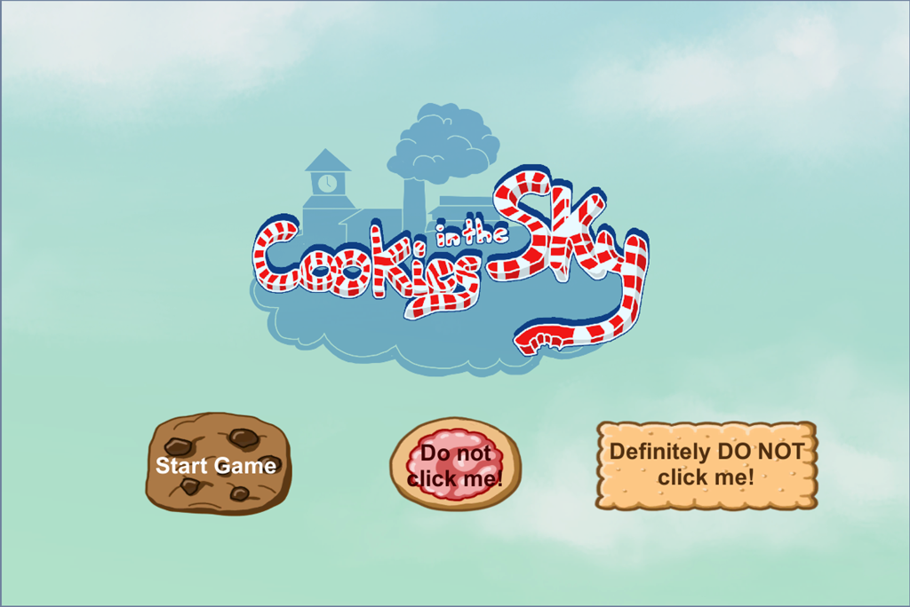

# Cookies in the Sky

The city in the clouds is in great danger since the old windmill who keeps the city levitating has become too slow. Slowly, but steadily, the city is falling to earth and since its platforms are made out of cookies, a hungry dragon monster named the "Lindwurm" has started to nibble on the lower cookie platforms of this beautiful town populated by various vegetables. Player 1 is playing a young apprentice boy who has to collect spare parts around town to repair the old windmill and rescue Sky-City. Player 2 aids him as his trusty old wind blower by manipulating the platforms.

Made during the [4th Klagenfurt Game Jam](https://www.itec.aau.at/gamejam/).

Special thanks to [Peter Hafele](http://www.peterhafele.com/) for making the [catchy music](http://www.peterhafele.com/wp-content/uploads/2017/10/Cookies-in-the-Sky-1-Portfolio.mp3).

### [Play on itch.io](https://kruemelkatze.itch.io/cookies-in-the-sky)

### [Download Executable](./Releases)

 

